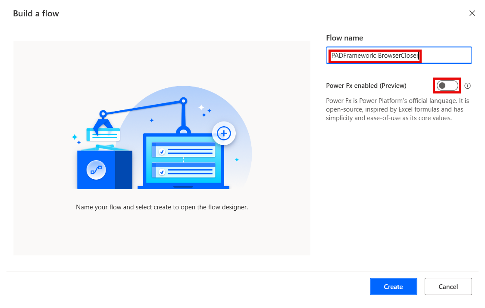
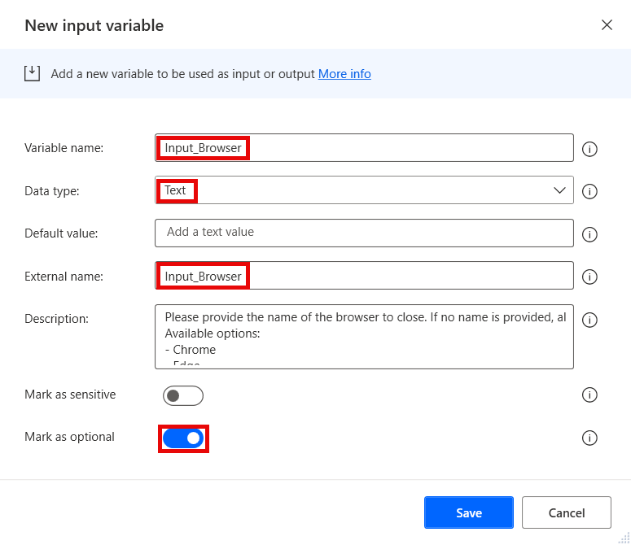
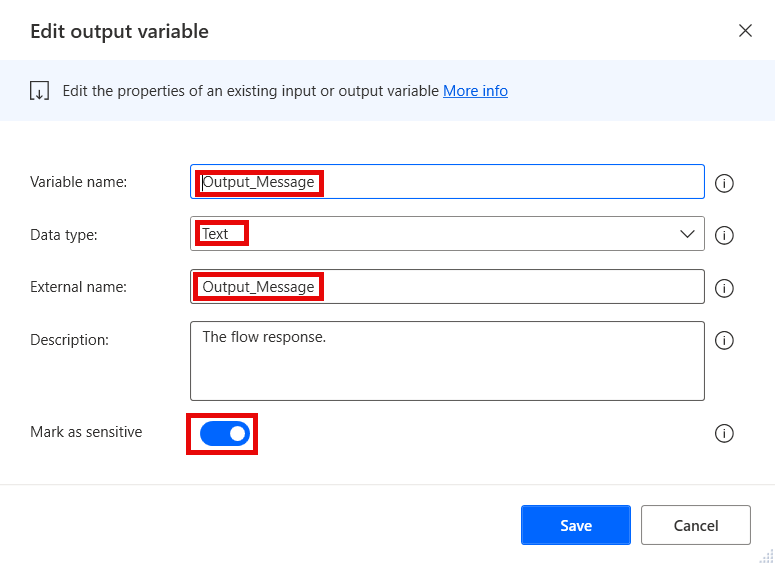
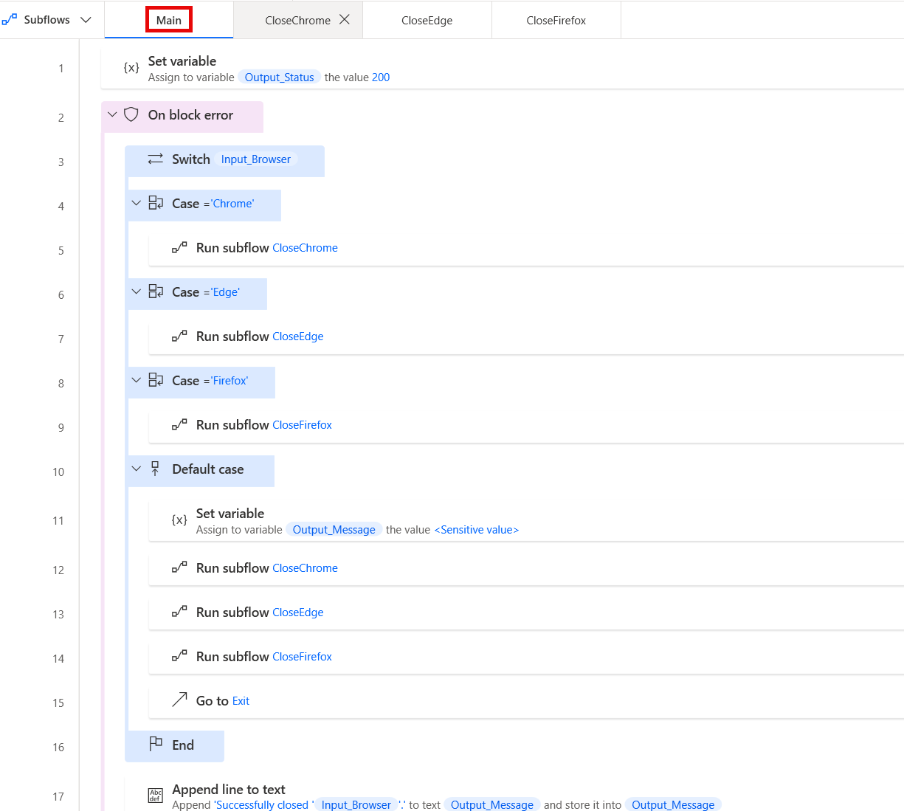

# BrowserCloser

The browser closer flow closes all browser instances/windows based on the inputs provided.
It is to be called as a child flow by other flows, and as such it should reside as a utility flow that does not need to be copied, but can be re-used.

## Disclaimer

Since a browser instance is a special type of variable that cannot be passed in between flows as inputs or outputs, we do not use **Close browser** here as the default method. If a single tab should be closed, it is recommended to still use **Close browser** in the source flow where the browser was launched for the happy path. But it is also possible to use Browser Closer with a URL provided to identify the specific tab to close.

## Version compatibility

The code is compatible with Power Automate Desktop version 2.43.204.24107 and later. Backward compatibility is not guaranteed, but it might work with earlier versions, too.
The code currently does not have a version for flows with Power Fx enabled. However, as this is a flow that should be called as a child flow by other flows, it should not matter. It should simply be created without enabling Power Fx.

## Inputs expected

There are several inputs required by this flow, and a couple that are optional (depending on other parameters):

1. **Input_Browser** - Should contain the name of the browser to be closed. If no browser name is provided, all open browser windows will be closed. Available options are:
    1. Chrome
    1. Edge
    1. Firefox
1. **Input_URL** - Should contain the URL for a specific browser tab to be closed. If no URL is provided, all browser tabs will be closed. If a URL is provided, but a tab with such a URL is not found, an error will be thrown.

## Output produced

The flow produces several output variables that are returned to the parent flow after execution:

1. **Output_Message** - Contains the response of the flow. Can either return a success, or a failure response. Should be used by the parent flow for any logging after closing the browser (or failing to do so). Should be marked as **sensitive** in case the message may contain any sensitive data.
1. **Output_Status** - Contains the status code for the response of the flow. Uses standard HTTP status codes. Can either return a success (200), or a failure status (4xx, 5xx). Should be checked by the parent flow to verify if closing the browser succeeded.

## Minimal path to awesome

1. If you have not prepared an environment and a solution for the framework yet:
    1. Open the browser and navigate to [Power Automate cloud portal](https://make.powerautomate.com/)
    1. Create an dedicated environment for the Framework (DEV environments for other flows should contain a managed solution of the Framework - see **Notes** below)
    1. Create a solution called **PADFramework** in the new environment
1. Open **Power Automate Desktop**
1. Create a new flow called **PADFramework: BrowserCloser** - make sure to not enable Power Fx when creating it

    

1. Create the following input and output variables (use the same names for "Variable name" and "External name" fields to avoid unneccessary confusion):
    1. Input:
        1. Input_Browser (Data type - Text; Mark as sensitive - False; Mark as optional - True)

            

        1. Input_URL (Data type - Text; Mark as sensitive - False; Mark as optional - True)
    1. Output:
        1. Output_Message (Data type: Text; Mark as sensitive - True)

            

        1. Output_Status (Data type: Number; Mark as sensitive - False)
1. Create new subflows: 
    1. **CloseChrome** 
    1. **CloseEdge** 
    1. **CloseFirefox**
1. Copy the code in the .txt files in `\source\` and paste it into Power Automate Desktop flow designer window into the appropriate subflows:
    1. **main.txt** to the **Main** subflow
    1. **close-chrome.txt** to the **ClosehChrome** subflow
    1. **close-edge.txt** to the **CloseEdge** subflow
    1. **close-firefox.txt** to the **CloseFirefox** subflow
1. Review the code for any syntax errors

    

1. Click **Save** in the flow designer
1. Add the **PADFramework: BrowserCloser** flow to the **PADFramework** solution for exporting it to other environments

    

1. When exporting to other environments, export it as a **Managed** solution, so that it can be used, but not modified. Logger should be managed even in DEV environments for other flows (see **Notes** below)
1. **Enjoy**

## Notes

### Environments

The Framework should have its own dedicated development environment. This is the only environment where the Framework should reside as an unmanaged solution. 

It should be imported as a managed solution to all other environments where flows will use the framework, including normal DEV, TEST, UAT and other non-production environments. This is so that changes cannot be made to the framework outside of its own DEV environment, but it can be used by calling utility flows such as the **Logger** as child flows, as well as making copies of the template flows for new projects.

### Support for Internet Explorer

Internet Explorer is not supported by Browser Closer, as the browser itself is no longer supported by Microsoft since June 2022. In most cases, even attempting to launch IE will result in Edge being launched instead. 
If you are using a system with Internet Explorer installed and need to use it for whatever reason, you can add an extra subflow to the Browser Launcher by copying **LaunchEdge** and modifying the parameters there.