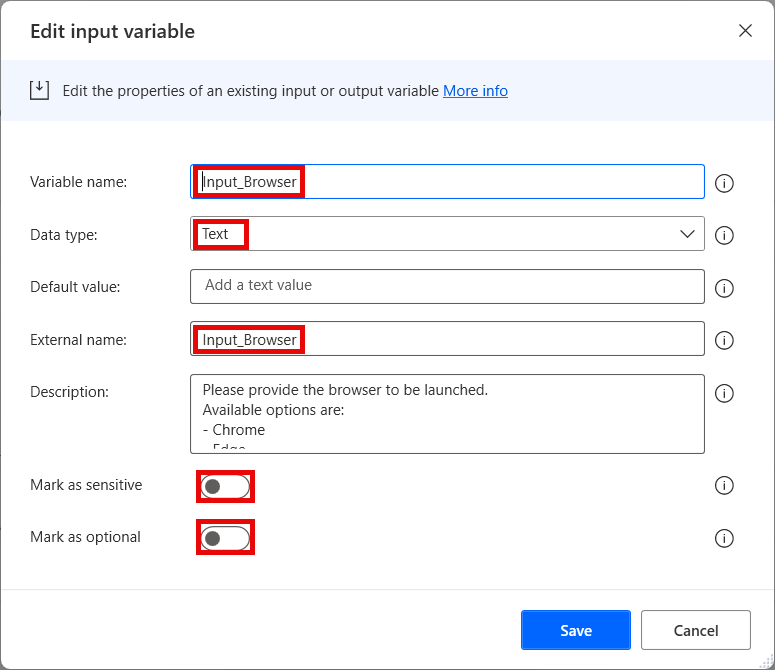
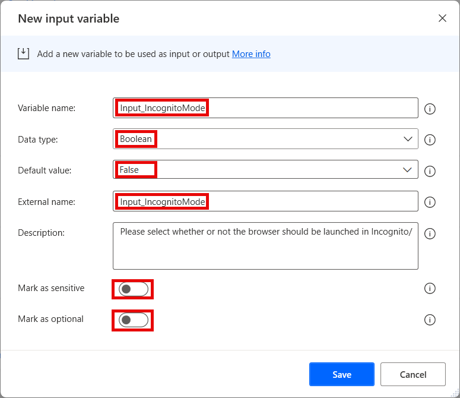
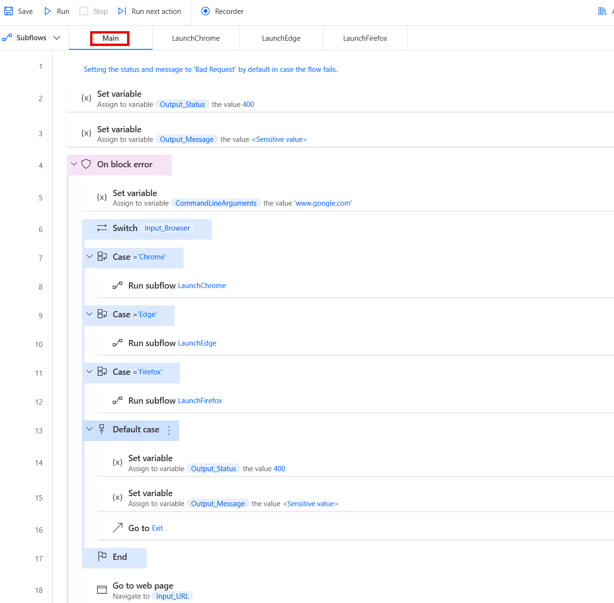
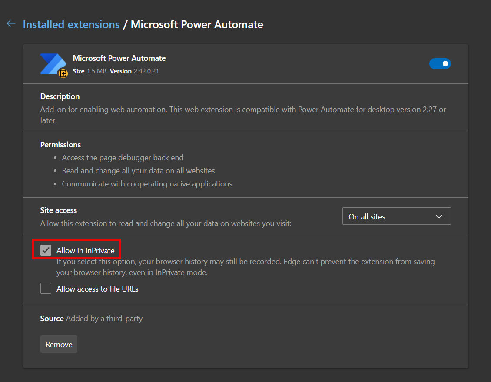
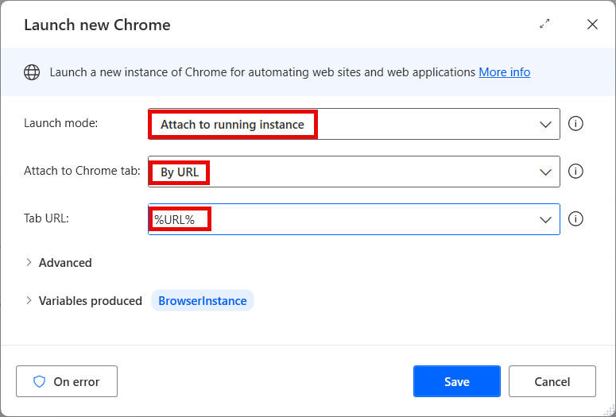

# BrowserLauncher

The browser launcher flow launches a browser instance based on the inputs provided.
It is to be called as a child flow by other flows, and as such it should reside as a utility flow that does not need to be copied, but can be re-used.

## Version compatibility

The code is compatible with Power Automate Desktop version 2.43.204.24107 and later. Backward compatibility is not guaranteed, but it might work with earlier versions, too.
The code currently does not have a version for flows with Power Fx enabled. However, as this is a flow that should be called as a child flow by other flows, it should not matter. It should simply be created without enabling Power Fx.

## Inputs expected

There are several inputs required by this flow, and a couple that are optional (depending on other parameters):

1. **Input_Browser** - Should contain the name of the browser to be launched. Available options are:
    1. Chrome
    1. Edge
    1. Firefox
1. **Input_IncognitoMode** - Defines whether or not the browser should be launched in Incognito/Private mode (see **Notes** below)
1. **Input_URL** - Should contain the URL to be opened upon launching the browser.

## Output produced

The flow produces several output variables that are returned to the parent flow after execution:

1. **Output_Message** - Contains the response of the flow. Can either return a success, or a failure response. Should be used by the parent flow for any logging after launching the browser (or failing to do so). Should be marked as **sensitive** in case the message may contain any sensitive data.
1. **Output_Status** - Contains the status code for the response of the flow. Uses standard HTTP status codes. Can either return a success (200), or a failure status (4xx, 5xx). Should be checked by the parent flow to verify if launching the browser succeeded.

## Minimal path to awesome

1. If you have not prepared an environment and a solution for the framework yet:
    1. Open the browser and navigate to [Power Automate cloud portal](https://make.powerautomate.com/)
    1. Create an dedicated environment for the Framework (DEV environments for other flows should contain a managed solution of the Framework - see **Notes** below)
    1. Create a solution called **PADFramework** in the new environment
1. Open **Power Automate Desktop**
1. Create a new flow called **PADFramework: BrowserLauncher** - make sure to not enable Power Fx when creating it

    

1. Create the following input and output variables (use the same names for "Variable name" and "External name" fields to avoid unneccessary confusion):
    1. Input:
        1. Input_Browser (Data type - Text; Mark as sensitive - False; Mark as optional - False)

            

        1. Input_IncognitoMode (Data type - Boolean; Default value - False; Mark as sensitive - False; Mark as optional - False)

            

        1. Input_URL (Data type - Text; Mark as sensitive - False; Mark as optional - False)
    1. Output:
        1. Output_Message (Data type: Text; Mark as sensitive - True)

            

        1. Output_Status (Data type: Number; Mark as sensitive - False)
1. Create new subflows (see **Notes** below): 
    1. **LaunchChrome** 
    1. **LaunchEdge** 
    1. **LaunchFirefox**
1. Copy the code in the .txt files in `\source\` and paste it into Power Automate Desktop flow designer window into the appropriate subflows:
    1. **main.txt** to the **Main** subflow
    1. **launch-chrome.txt** to the **LaunchChrome** subflow (see **Notes** below)
    1. **launch-edge.txt** to the **LaunchEdge** subflow (see **Notes** below)
    1. **launch-firefox.txt** to the **LaunchFirefox** subflow (see **Notes** below)
1. Review the code for any syntax errors

    

1. Click **Save** in the flow designer
1. In the parent flow, add a **Launch New {Browser}** action after running the browser launcher and make it attach to running instance using the URL you provided as inputs (see **Notes** below)
1. Add the **PADFramework: BrowserLauncher** flow to the **PADFramework** solution for exporting it to other environments

    

1. When exporting to other environments, export it as a **Managed** solution, so that it can be used, but not modified. Logger should be managed even in DEV environments for other flows (see **Notes** below)
1. **Enjoy**

## Notes

### Environments

The Framework should have its own dedicated development environment. This is the only environment where the Framework should reside as an unmanaged solution. 

It should be imported as a managed solution to all other environments where flows will use the framework, including normal DEV, TEST, UAT and other non-production environments. This is so that changes cannot be made to the framework outside of its own DEV environment, but it can be used by calling utility flows such as the **Logger** as child flows, as well as making copies of the template flows for new projects.

### Launching the browser in Incognito/Private

If the browser should be launched in Incognito/Private mode, the parent flow should set the `Input_IncognitoMode` input variable to `True`.
However, for this to work, some settings need to be adjusted on the corresponding browser on the machine where the flow runs. The browser extensions need to be allowed to run in Incognito/Private mode, which is disabled by default.

This can be done via the extension details on each browser.

### Skipping irrelevant browsers

In case some of the browsers provided are irrelevant (i.e. you do not plan to ever use them in any of your flows, and want prevent makers in your organization from using them), you can skip creating the related subflows. The Browser Launcher flow can work perfectly fine with less subflows. All you need to do then is:
1. Not create the subflow for the browser you want to ignore
1. Adjust **Main** to remove the `Case` statement under the `Switch` construct to remove the browser as an option

When you do that, if any flow calls the Browser Launcher with the request to launch the browser that is not included, the Browser Launcher will return an error as handled by the `Default case`.

### Support for Internet Explorer

Internet Explorer is not supported by Browser Launcher, as the browser itself is no longer supported by Microsoft since June 2022. In most cases, even attempting to launch IE will result in Edge being launched instead. 
If you are using a system with Internet Explorer installed and need to use it for whatever reason, you can add an extra subflow to the Browser Launcher by copying **LaunchEdge** and modifying the parameters there.

### Attaching to the browser in the parent flow

A browser instance is a special type of variable and it cannot be returned as an output variable by the child flow.
As such, in order to use the browser that was launched by Browser Launcher in the parent flow for further web automation tasks, you will need to attach to it. Use **Launch New {Browser}** action for the appropriate action after running the child flow, and make it attach to a running instance by providing the same URL that was used to launch the browser as a parameter. Here's an example for what that would look like for Chrome:

