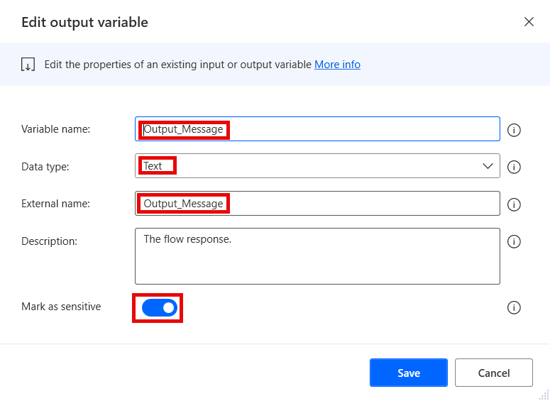
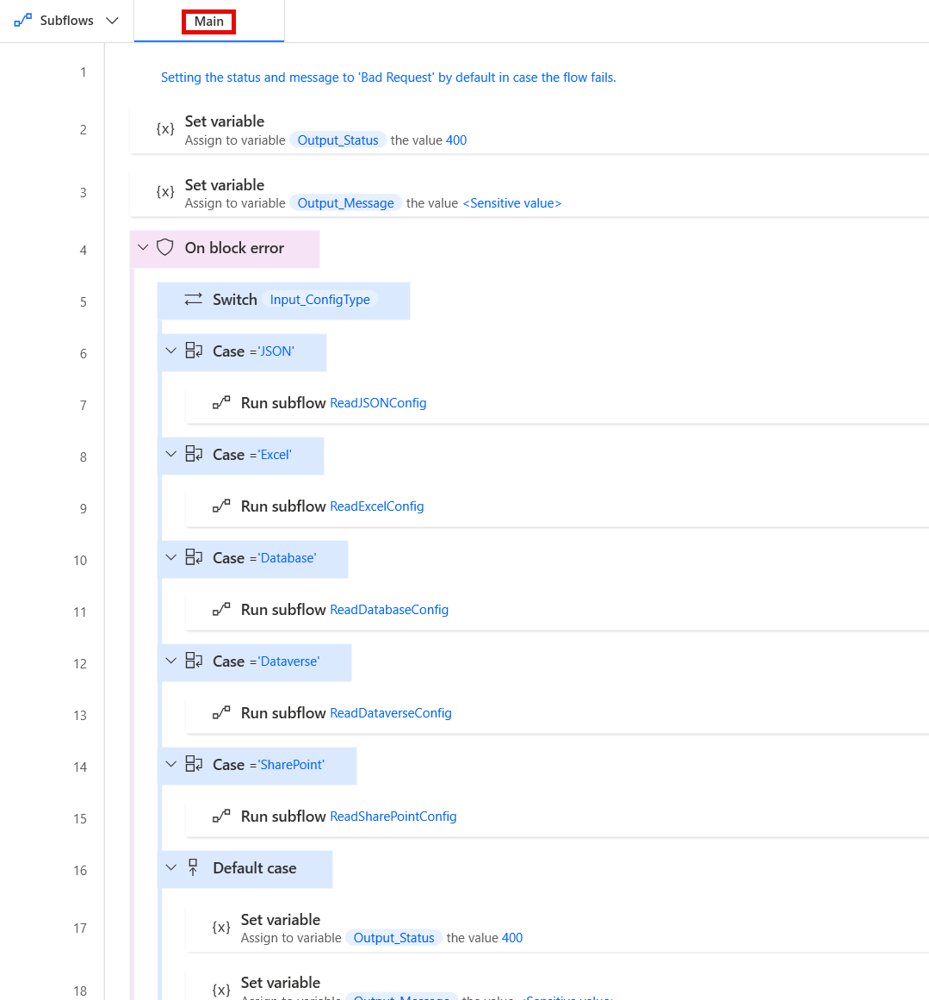

# ConfigReader

The ConfigReader flow retrieves externally stored config values for the parent flow based on the inputs provided.
It is to be called as a child flow by other flows, and as such it should reside as a utility flow that does not need to be copied, but can be re-used.

## Disclaimer
This utility flow is only required if you want to config data externally, and do not want to have a cloud flow retrieving it and passing it into the desktop flow as inputs. If you prefer using Power Platform environment variables in solutions, or have external configurations retrieved via a cloud flow, this utility flow is not needed.

## Version compatibility

The code is compatible with Power Automate Desktop version 2.45.375.24159 and later. Backward compatibility is not guaranteed, but it might work with earlier versions, too.
The code currently does not have a version for flows with Power Fx enabled. However, as this is a flow that should be called as a child flow by other flows, it should not matter. It should simply be created without enabling Power Fx.

## Inputs expected

There are several inputs required by this flow, and a couple that are optional (depending on other parameters):

1. **Input_ConfigAddress** - Should contain the address for where the config resource is stored. Should be marked as **sensitive** in case the string contains any sensitive information, such as credentials. Should also be marked as **optional** as it is optional for other config types. For the types where it is necessary, the flow expects it to contain:
    - the connection string the config type is 'Database'
    - the site address when the type is 'SharePoint'
    - the environment URL when the type is 'Dataverse' (can be found in the environment details in the PP admin center)
    - the file path when the type is 'Excel'
1. **Input_ConfigPath** - Should contain the path to the config data. Should be marked as **sensitive** in case it contains any sensitive information. The flow expects it to contain:
    - the file path when the config type is 'JSON'
    - a sheet name when the type is 'Excel' 
    - a list name when the type is 'SharePoint' 
    - a table logical name when the type is 'Dataverse'
    - a stored procedure name when the type is 'Database'
1. **Input_ConfigType** - Should contain the config type. Currently supported options are:
    1. JSON
    1. Excel
    1. Database
    1. Dataverse
    1. SharePoint
1. **Input_ProjectName** - Should contain the name of the project to identify the relevant entries in the database. Should be marked as **optional**, as it is irrelevant when config type is 'JSON' or 'Excel'.

## Output produced

The flow produces several output variables that are returned to the parent flow after execution:

1. **Output_ConfigObject** - Returns the custom object with the config data. Should be marked as **sensitive** as the data may contain sensitive values.
1. **Output_Message** - Contains the response of the flow. Can either return a success, or a failure response. Should be used by the parent flow for any logging after calling the child flow. Should be marked as **sensitive** in case the message may contain any sensitive data.
1. **Output_Status** - Contains the status code for the response of the flow. Uses standard HTTP status codes. Can either return a success (200), or a failure status (4xx, 5xx). Should be checked by the parent flow to verify if the child flow succeeded.

## Minimal path to awesome

1. If you have not prepared an environment and a solution for the framework yet:
    1. Open the browser and navigate to [Power Automate cloud portal](https://make.powerautomate.com/)
    1. Create an dedicated environment for the Framework (DEV environments for other flows should contain a managed solution of the Framework - see **Notes** below)
    1. Create a solution called **PADFramework** in the new environment
1. Open **Power Automate Desktop**
1. Create a new flow called **PADFramework: WorkItemHandler** - make sure to not enable Power Fx when creating it

    

1. Create the following input and output variables (use the same names for "Variable name" and "External name" fields to avoid unneccessary confusion):
    1. Input:
        1. Input_ConfigAddress (Data type - Text; Mark as sensitive - True; Mark as optional - False)

            

        1. Input_ConfigPath (Data type - Text; Mark as sensitive - True; Mark as optional - False)
        1. Input_ConfigType (Data type - Text; Mark as sensitive - False; Mark as optional - False)
        1. Input_ProjectName (Data type - Text; Mark as sensitive - False; Mark as optional - True)
    1. Output:
        1. Output_ConfigObject (Data type: Custom object; Mark as sensitive - True)
        1. Output_Message (Data type: Text; Mark as sensitive - True)

            

        1. Output_Status (Data type: Number; Mark as sensitive - False)

1. Create new subflows (see **Notes**): 
    1. **ConvertTabularConfigToCustomObject** 
    1. **ReadDatabaseConfig** 
    1. **ReadDataverseConfig**
    1. **ReadExcelConfig**
    1. **ReadJSONConfig**
    1. **ReadSharePointConfig**
    1. **RunExcelCloser**
1. Copy the code in the .txt files in `\source\` and paste it into Power Automate Desktop flow designer window into the appropriate subflows (see **Notes**):
    1. **main.txt** to the **Main** subflow
    1. **convert-tabular-config-to-custom-object.txt** to the **ConvertTabularConfigToCustomObject** subflow
    1. **read-database-config.txt** to the **ReadDatabaseConfig** subflow
    1. **read-dataverse-config.txt** to the **ReadDataverseConfig** subflow
    1. **read-excel-config.txt** to the **ReadExcelConfig** subflow
    1. **read-json-config.txt** to the **ReadJSONConfig** subflow
    1. **read-sharepoint-config.txt** to the **ReadSharePointConfig** subflow
    1. **run-excel-closer.txt** to the **RunExcelCloser** subflow
1. Review the code for any syntax errors

    

1. Click **Save** in the flow designer
1. Add the **PADFramework: ConfigReader** flow to the **PADFramework** solution for exporting it to other environments

    

1. When exporting to other environments, export it as a **Managed** solution, so that it can be used, but not modified. Logger should be managed even in DEV environments for other flows (see **Notes** below)
1. **Enjoy**

## Notes

### Environments

The Framework should have its own dedicated development environment. This is the only environment where the Framework should reside as an unmanaged solution. 

It should be imported as a managed solution to all other environments where flows will use the framework, including normal DEV, TEST, UAT and other non-production environments. This is so that changes cannot be made to the framework outside of its own DEV environment, but it can be used by calling utility flows such as the **WorkItemHandler** as child flows, as well as making copies of the template flows for new projects.

### Different types of configs

In most organizations, you would normally not want to have different types of storage for external configs being used across flows. It's best to pick one and stick to that. So, you do not actually need to create all of the subflows listed here, as this adds extra complexity where it is not necessary. Feel free to just go with the one type of config you prefer.

### Using direct SQL Statements vs Stored Procedures in SQL Server

Using Stored Procedures is the recommended approach when working with SQL Server, as SQL code is then handled by the database admin and it then becomes much easier to manage what a user or a group of users is allowed to do within the database. It requires actually creating those stored procedures, but it then enables much better governance.