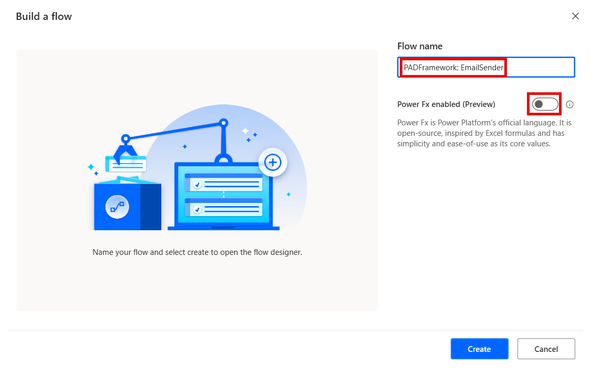
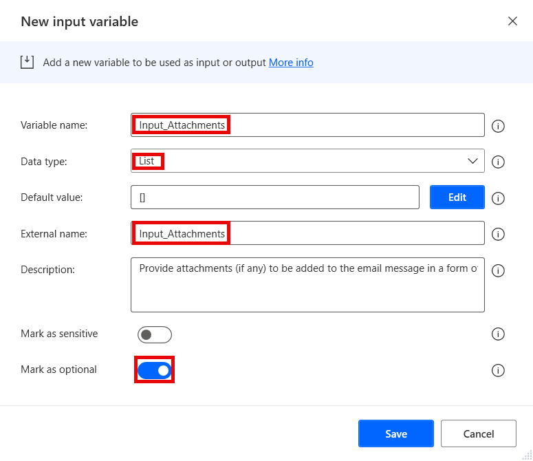
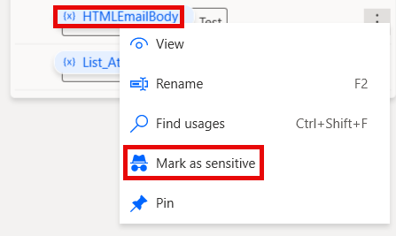
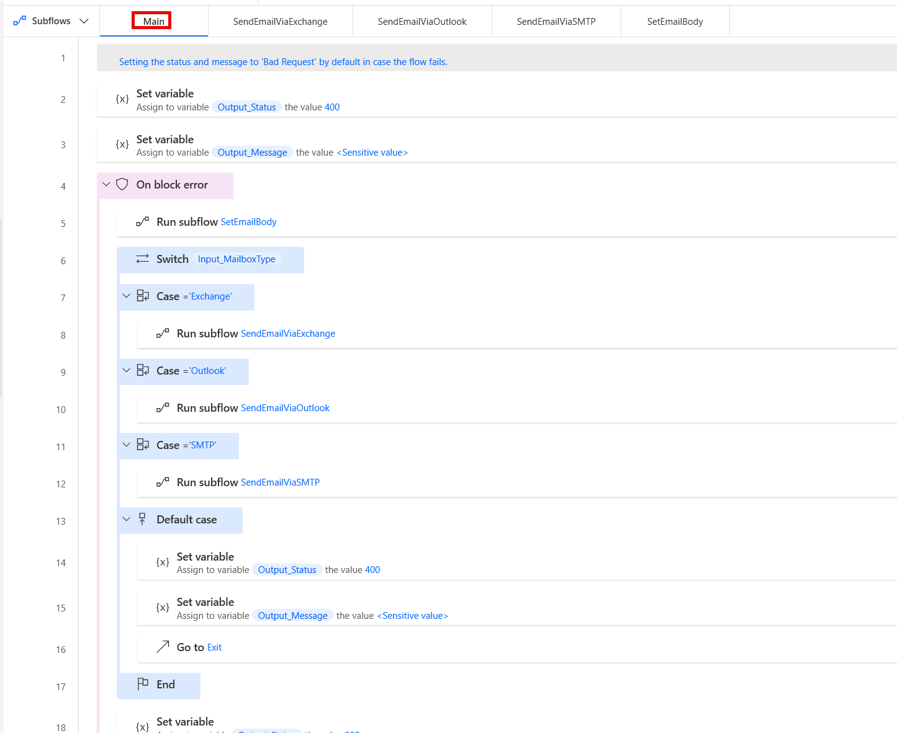

# EmailSender

The Email Sender flow sends an email message based on the inputs provided.
It is to be called as a child flow by other flows, and as such it should reside as a utility flow that does not need to be copied, but can be re-used.

It is to be used when any kind of a report needs to be sent, including sending error notifications to process owners, as well as info messages to either internal or external people.
It does not include any more advanced functionality for sending emails, such as sending as someone else via delegated permissions or BCC to avoid unnecessary complexity. If needed, it can easily be added.
It can include attachments if needed.

## Version compatibility

The code is compatible with Power Automate Desktop version 2.43.204.24107 and later. Backward compatibility is not guaranteed, but it might work with earlier versions, too.
The code currently does not have a version for flows with Power Fx enabled. However, as this is a flow that should be called as a child flow by other flows, it should not matter. It should simply be created without enabling Power Fx.

## Inputs expected

There are several inputs required by this flow, and a couple that are optional (depending on other parameters):

1. **Input_Attachments** - Should contain a list of files as attachments. Is optional - if the provided list is empty, the email will still be sent with no attachments.
1. **Input_DisplayName** - Should contain the display name to be used for the sender.
1. **Input_EmailAccount** - Should contain the email address to be used for sending the email. 
1. **Input_EmailMessage** - Should contain the email message. It should be formatted as HTML, or else the entire body will be sent as a single paragraph. Should not include any parts of the email body that are already in the HTML template.
1. **Input_EmailRecipient** - Should contain the email address(es) of the recipient(s). If more than one recipient is included, they should be separated by a semicolon. Should be marked as **sensitive**.
1. **Input_EmailRecipientCC** - Should contain the email address(es) of the CC recipient(s). Can be left blank. If more than one recipient is included, they should be separated by a semicolon. Should be marked as **sensitive**.
1. **Input_EmailSubject** - Should contain the subject text for the email message.
1. **Input_ExchangeObject** - Should contain a custom object with Exchange server parameters. This is optional and can be left blank for other mailbox types. Can also be left blank for Exchange server, too - in such a case "Auto discovery" will be used as the connection type and "Exchange default" will be used for the credentials. Should be marked as **sensitive** as it includes credentials. The following parameters are expected in the object if it's not blank:
    1. Server - the server address
    1. Domain - for the user account
    1. Username
    1. Password
1. **Input_HTMLTemplatePath** - Should contain the path to the template for the email body (see **Notes** below).
1. **Input_MailboxType** - Should contain the type of mailbox to be used for sending the email. The flow currently supports the following types:
    1. Exchange 
    1. Outlook - uses the Outlook application (see **Notes** below)
    1. SMTP - uses the actions under the *Email* action group
1. **Input_SMTPObject** - Should contain a custom object with SMTP server parameters. This is optional and can be left blank for other mailbox types, but is required if the mailbox type is *SMTP*. Should be marked as **sensitive** as it includes credentials. The following parameters are expected in the object:
    1. Server - the SMTP server address
    1. Port
    1. Username
    1. Password

## Output produced

The flow produces several output variables that are returned to the parent flow after execution:

1. **Output_Message** - Contains the response of the flow. Can either return a success, or a failure response. Should be used by the parent flow for any logging after sending an email (or failing to do so). Should be marked as **sensitive** in case the message may contain any sensitive data.
1. **Output_Status** - Contains the status code for the response of the flow. Uses standard HTTP status codes. Can either return a success (200), or a failure status (4xx, 5xx). Should be checked by the parent flow to verify if sending an email succeeded.

## Minimal path to awesome

1. If you have not prepared an environment and a solution for the framework yet:
    1. Open the browser and navigate to [Power Automate cloud portal](https://make.powerautomate.com/)
    1. Create an dedicated environment for the Framework (DEV environments for other flows should contain a managed solution of the Framework - see **Notes** below)
    1. Create a solution called **PADFramework** in the new environment
1. Save the **email-template.html** file and adjust it according to your own organizational formatting (see **Notes** below).
1. Open **Power Automate Desktop**
1. Create a new flow called **PADFramework: EmailSender** - make sure to not enable Power Fx when creating it

    

1. Create the following input and output variables (use the same names for "Variable name" and "External name" fields to avoid unneccessary confusion):
    1. Input:
        1. Input_Attachments (Data type - List; Mark as sensitive - False; Mark as optional - True)

            

        1. Input_DisplayName (Data type - Text; Mark as sensitive - False; Mark as optional - False)
        1. Input_EmailAccount (Data type - Text; Mark as sensitive - False; Mark as optional - False)
        1. Input_EmailMessage (Data type - Text; Mark as sensitive - True; Mark as optional - False)
        1. Input_EmailRecipient (Data type - Text; Mark as sensitive - True; Mark as optional - False)
        1. Input_EmailRecipientCC (Data type - Text; Mark as sensitive - True; Mark as optional - True)
        1. Input_EmailSubject (Data type - Text; Mark as sensitive - False; Mark as optional - False)
        1. Input_ExchangeObject (Data type - Custom object; Mark as sensitive - True; Mark as optional - True)
        1. Input_HTMLTemplatePath (Data type - Text; Mark as sensitive - False; Mark as optional - False)
        1. Input_MailboxType (Data type - Text; Mark as sensitive - False; Mark as optional - False)
        1. Input_SMTPObject (Data type - Custom object; Mark as sensitive - True; Mark as optional - True)
    1. Output:
        1. Output_Message (Data type: Text; Mark as sensitive - True)

            

        1. Output_Status (Data type: Number; Mark as sensitive - False)
1. Create new subflows (see **Notes** below): 
    1. **SendEmailViaExchange** 
    1. **SendEmailViaOutlook** 
    1. **SendEmailViaSMTP**
    1. **SetEmailBody**
1. Copy the code in the .txt files in `\source\` and paste it into Power Automate Desktop flow designer window into the appropriate subflows:
    1. **main.txt** to the **Main** subflow
    1. **send-email-via-exchange.txt** to the **SendEmailViaExchange** subflow (see **Notes** below)
    1. **send-email-via-outlook.txt** to the **SendEmailViaOutlook** subflow (see **Notes** below)
    1. **send-email-via-smtp.txt** to the **SendEmailViaSMTP** subflow (see **Notes** below)
    1. **set-email-body.txt** to the **SetEmailBody** subflow
1. Right-click on the the *HTMLEmailBody* variable in the Variables pane and set it as sensitive, as it will contain the email message.

    

1. Review the code for any syntax errors

    

1. Click **Save** in the flow designer
1. Add the **PADFramework: EmailSender** flow to the **PADFramework** solution for exporting it to other environments

    

1. When exporting to other environments, export it as a **Managed** solution, so that it can be used, but not modified. Logger should be managed even in DEV environments for other flows (see **Notes** below)
1. **Enjoy**

## Notes

### Environments

The Framework should have its own dedicated development environment. This is the only environment where the Framework should reside as an unmanaged solution. 

It should be imported as a managed solution to all other environments where flows will use the framework, including normal DEV, TEST, UAT and other non-production environments. This is so that changes cannot be made to the framework outside of its own DEV environment, but it can be used by calling utility flows such as the **EmailSender** as child flows, as well as making copies of the template flows for new projects.

### Support for Office 365 Outlook

This flow does not support sending emails via the Office 365 Outlook connector because the connector requires a connection reference being set up. As such, Desktop flows like that currently cannot be shared with other users. 
A separate flow will be created specifically for sending emails via the Office 365 Outlook action, so that it can be copied when needed, instead of having to copy the entire Email Sender utility.

### Using Exchange server
The Email Sender is currently set up to use Exchange 2013 SP1 as the server version (which generally works with later versions, too, as well as Exchange Online). If you need to use an older version of Exchange Server, adjust the *Connect to Exchange server* action in the **SendEmailViaExchange** subflow accordingly.

### Using the local Outlook application

If *Outlook* is used as the mailbox type, the user needs to make sure the following is true:
1. The Outlook application is installed and set up on the machine.
1. The "New Outlook" option is disabled in the Outlook application - PAD currently does not support the New Outlook and will fail to launch the application if it is enabled.

Also, note that the flow will not close Outlook after sending the email. This is to avoid the email from being interrupted, if it takes a while to be sent (especially when attachments are included). If it is relevant to close Outlook after sending the email, add a *Close Outlook* action at the end of the **SendEmailViaOutlook** subflow.

### Skipping irrelevant mailbox types

In case some of the mailbox types provided are irrelevant (i.e. you do not plan to ever use them in any of your flows, and want prevent makers in your organization from using them), you can skip creating the related subflows. The Email Sender flow can work perfectly fine with less subflows. All you need to do then is:
1. Not create the subflow for the mailbox type you want to ignore
1. Adjust **Main** to remove the `Case` statement under the `Switch` construct to remove the mailbox type as an option
1. Adjust the **Input_MailboxType** variable description to not include the mailbox type, so that makers are aware it is not supported.

When you do that, if any flow calls the Email Sender with the request to send an email via a mailbox type that is not included, the Email Sender will return an error as handled by the `Default case`.

### Using the HTML template
The **email-template.html** file in `\source\` is a sample HTML file that can be used for the email template. You should adapt it to your own needs with appropriate styles, signatures, links, etc. The minimum changes needed are:
1. Adding a correct link to the logo OR removing it from the signature completely
1. Adding the correct company name OR removing it from the signature completely
1. Adding the correct company address OR removing it from the signature completely
1. Adding the correct company website address OR removing it from the signature completely

Further optional changes include:
1. Adjusting the styles for the fonts you need
1. Adding any extra style classes if needed
1. Adding further details to the signature as needed (e.g. an email address, a phone number, a confidentiality disclaimer, etc.)