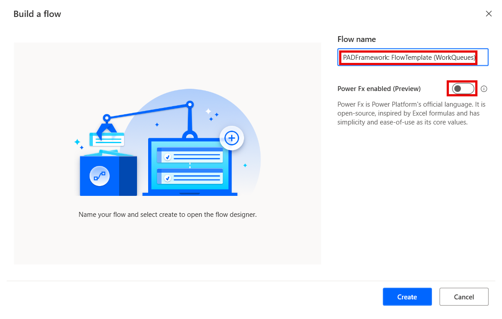
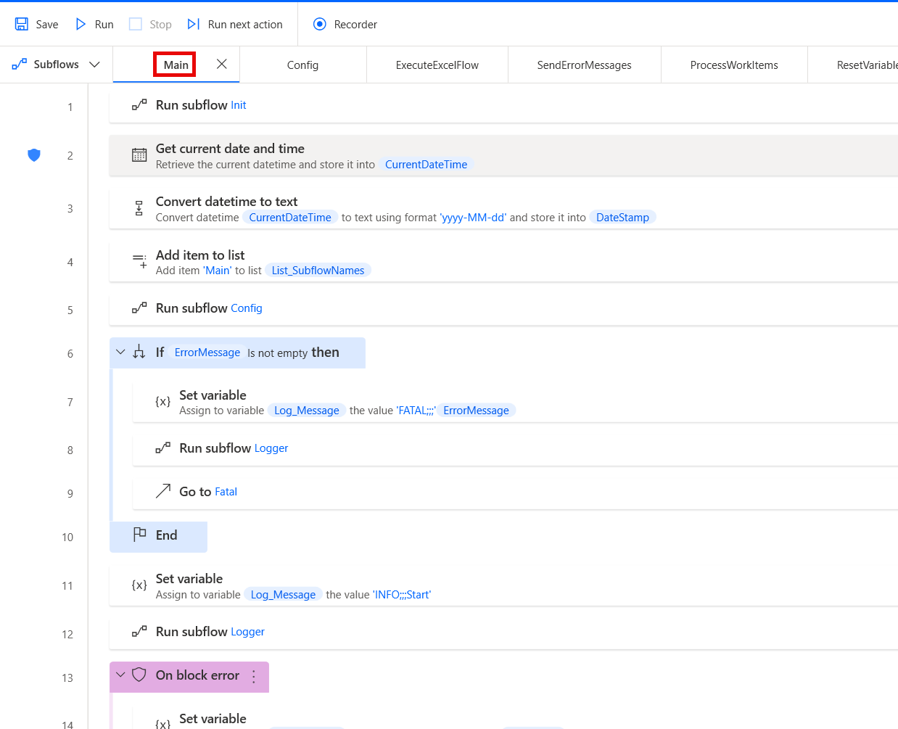

# FlowTemplate (WorkQueues)

The Flow Template is intended to be copied and modified for each new project that needs to be built. It contains the standard structure for flows, calls to utility flows, as well as a standard template for custom subflows.
It is the only part of the framework that should in fact be modified by makers, but only after making a copy. The original template should still remain intact for others to use it.

The *WorkQueues* version of the Flow Template uses the Power Automate Work Queues to process work items, unlike the default Flow Template that uses custom SQL databases to do it.

## Version compatibility

The code is compatible with Power Automate Desktop version 2.52.62.25009. Compatibility with other versions is not guaranteed, but it might work with earlier versions, too.
The code currently does not have a version for flows with Power Fx enabled. 

## Inputs expected

By default, the template does not require any inputs, but input variables can be added based on custom requirements of each flow.

## Output produced

The flow produces several output variables that are returned to the parent flow (cloud or desktop) after execution:

1. **ErrorMessage** - Contains the last error message generated by the flow before it stopped. Should be marked as **sensitive** in case the message may contain any sensitive data.
1. **Output_IsSuccess** - Contains a boolean value that is equal to `True` when the flow completes successfully, or `False` when it fails.

## Minimal path to awesome

1. If you have not prepared an environment and a solution for the framework yet:
    1. Open the browser and navigate to [Power Automate cloud portal](https://make.powerautomate.com/)
    1. Create an dedicated environment for the Framework (DEV environments for other flows should contain a managed solution of the Framework - see **Notes** below)
    1. Create a solution called **PADFramework** in the new environment
1. If you have not created the other utility flows within the framework, create them first, as they will be used as child flows in the template.
1. Open **Power Automate Desktop**
1. Create a new flow called **PADFramework: FlowTemplate (WorkQueues)** - make sure to not enable Power Fx when creating it

    

1. Create the following output variables (use the same names for "Variable name" and "External name" fields to avoid unneccessary confusion):
    1. ErrorMessage (Data type: Text; Mark as sensitive - True)

        

    1. Output_IsSuccess (Data type: Boolean; Mark as sensitive - False)
1. Create the following subflows:
    1. **CleanupOnError**
    1. **CloseBrowser** 
    1. **CloseExcel** 
    1. **CompleteWorkItem**
    1. **ExecuteExcelflow**
    1. **ExecuteMainFlow**
    1. **ExecuteWebflow**
    1. **GenerateWorkItems**
    1. **GetFlowSettings**
    1. **GetWorkItem**
    1. **Init**
    1. **InsertWorkItem**
    1. **LaunchBrowser**
    1. **Logger**
    1. **LoginToWebPage**
    1. **PrepareSystem**
    1. **PrepareWebPage**
    1. **ProcessWorkItem**
    1. **ProcessWorkItems**
    1. **ResetVariables**
    1. **SendErrorMessages**
    1. **SerializeWorkItem**
    1. **StopFlow**
    1. **TakeScreenshot**
    1. **Template**
    1. **ThrowFatalError**
1. Copy the code in the files in `\source\` and paste it into Power Automate Desktop flow designer window into the appropriate subflows:
    1. **main.txt** to **Main**
    1. **cleanup-on-error.txt** to **CleanupOnError**
    1. **close-browser.txt** to **CloseBrowser** 
    1. **close-excel.txt** to **CloseExcel** 
    1. **complete-work-item.txt** to **CompleteWorkItem**
    1. **execute-excel-flow.txt** to **ExecuteExcelFlow**
    1. **execute-main-flow.txt** to **ExecuteMainFlow**
    1. **execute-web-flow.txt** to **ExecuteWebFlow**
    1. **generate-work-items.txt** to **GenerateWorkItems**
    1. **get-flow-settings.txt** to **GetFlowSettings**
    1. **get-work-item.txt** to **GetWorkItem**
    1. **init.txt** to **Init**
    1. **insert-work-item.txt** to **InsertWorkItem**
    1. **launch-browser.txt** to **LaunchBrowser**
    1. **logger.txt** to **Logger**
    1. **login-to-web-page.txt** to **LoginToWebPage**
    1. **prepare-system.txt** to **PrepareSystem**
    1. **prepare-web-page.txt** to **PrepareWebPage**
    1. **process-work-item.txt** to **ProcessWorkItem**
    1. **process-work-items.txt** to **ProcessWorkItems**
    1. **reset-variables.txt** to **ResetVariables**
    1. **send-error-messages.txt** to **SendErrorMessages**
    1. **serialize-work-item.txt** to **SerializeWorkItem**
    1. **stop-flow.txt** to **StopFlow**
    1. **take-screenshot.txt** to **TakeScreenshot**
    1. **template.txt** to **Template**
    1. **throw-fatal-error.txt** to **ThrowFatalError**
1. Adjust the utility desktop flows called by the `Run desktop flow` actions in the following subflows:
    1. **CloseBrowser**
    1. **CloseExcel**
    1. **Config**
    1. **LaunchBrowser**
    1. **Logger**
    1. **SendErrorMessages**
    1. **TakeScreenshot**
1. Review the code for any syntax errors

    

1. Click **Save** in the flow designer
1. Add the **PADFramework: FlowTemplate (WorkQueues)** flow to the **PADFramework** solution for exporting it to other environments

    

1. When exporting to other environments, export it as a **Managed** solution, so that it can be used, but not modified. Logger should be managed even in DEV environments for other flows (see **Notes** below)
1. **Enjoy**

## Using the template

### Making a copy

When makers want to start creating a new flow, they should follow these guidelines: 
1. Create a project directory on the machine or a network directory for:
    1. Logs (if logging to files)
    1. Config (if a config file is used)
    1. Flow (if temporary files and/or screenshots are used)
1. Make a copy of the Flow Template and use it as the basis

    

1. Remove any unneccesary subflows from the copy (e.g. any Browser-related subflows if web automation is not part of the target flow)
1. Adjust the following subflows appropriately as described in the comments:
    1. **Init**
    1. **CleanupOnError**
    1. **Config**
    1. **ExecuteExcelFlow**
    1. **ExecuteMainFlow**
    1. **ExecuteWebFlow**
    1. **LoginToWebPage**
    1. **PrepareSystem**
    1. **PrepareWebPage**
1. Copy the **Template** subflow for any custom subflows that are needed.
1. Add any custom actions inside the `On block error` action in these custom subflows.
1. Add appropriate subflow calls for these custom subflows to parent subflows

## Non-default subflows

Some subflows are not called anywhere by default within the Flow Template. This is because they are not always needed. This includes Browser related subflows, as well as Excel related subflows. 
If makers want to use them, calls should be added appropriately to either **ExecuteMainFlow** or **ProcessWorkItem** based on the custom logic of the flow.

### Work Item Handling

When building flows using this template, it is recommended to separate flows that generate (create) work items from those that process them. This is to apply the Single Responsibility Principle (SRP) of software programming.

As such, the flows that generate work items will require the **GenerateWorkItems** subflow with its child subflows, but may not require **ProcessWorkItems** and vice versa for flows that process work items.

The default **ExecuteMainFlow** subflow contains a call for **ProcessWorkItems** but this should be amended accordingly.

## Notes

### Environments

The Framework should have its own dedicated development environment. This is the only environment where the Framework should reside as an unmanaged solution. 

It should be imported as a managed solution to all other environments where flows will use the framework, including normal DEV, TEST, UAT and other non-production environments. This is so that changes cannot be made to the framework outside of its own DEV environment, but it can be used by calling utility flows such as the **Logger** as child flows, as well as making copies of the template flows for new projects.