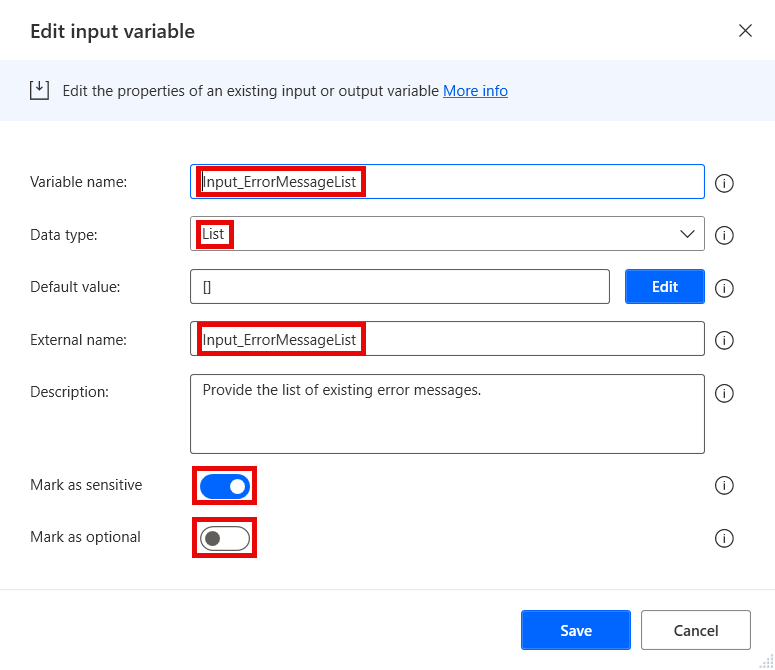
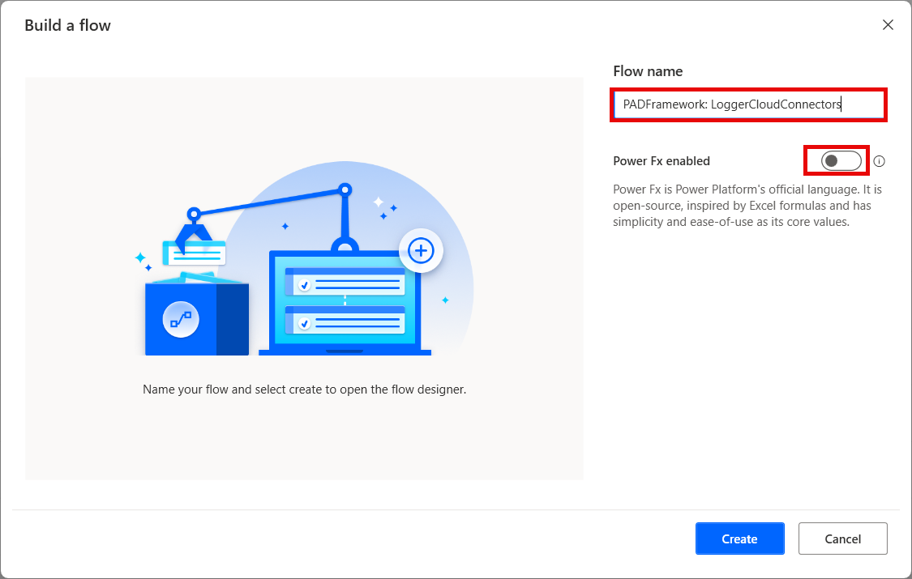
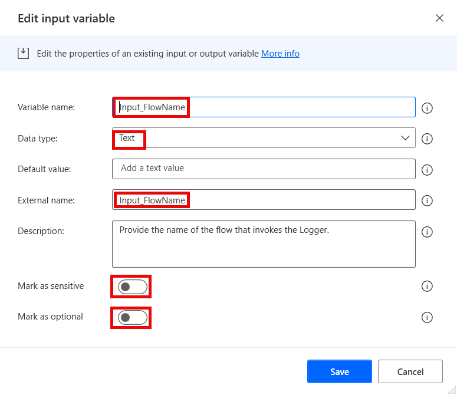
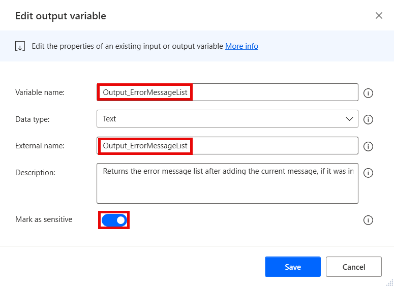
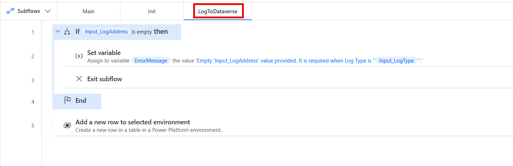

# LoggerCloudConnectors

The logger flow creates a log message entry in a specific log type as provided via input parameters. The Cloud Connectors version of the Logger logs to either a SharePoint list or a Dataverse table. See **Notes** below regarding the use of the Logger flows.

## Version compatibility

The code is compatible with Power Automate Desktop version 2.50.125.24304. Compatibility with other versions is not guaranteed, but it might work with earlier versions, too.
The code currently does not have a version for flows with Power Fx enabled. However, as this is a flow that should be called as a child flow by other flows, it should not matter. It should simply be created without enabling Power Fx.

## Inputs expected

There are several inputs required by this flow, and a couple that are optional (depending on other parameters):

1. **Input_ErrorMessageList** - Should contain the list of error messages already accumulated in the parent flow. Is used to add the new message (if it is an error message) and produce the output list. Can be a blank list, if no prior error messages exist. Should be marked as **sensitive** in case the error messages contain any sensitive information.
1. **Input_FlowName** - Should contain the name of the parent flow. Is used in the logs.
1. **Input_LogAddress** - Should contain the address for certain log types. Is required for all log types in this flow. See the definition for **Input_LogType** below for more details. 
1. **Input_LoggerObject** - Should be a custom object that contains at least two parameters: 'LogLevels' (defining the levels of messages that should be logged in a case-sensitive, comma-separated string) and 'ErrorLogLevels' (defining the levels of messages that should be added to the error messages list in a case-sensitive, comma-separated string). Is used for logging.
1. **Input_LogMessage** - Should contain the actual message to log, possibly with the entire stack trace for system exceptions. Should be marked as **sensitive** in case the message contains any sensitive data. The message must be preceeded by the log level and three (3) semicolons to separate the level from the message. For example: `INFO;;;Finished processing work item no. 123456 with status 'Success'.`
1. **Input_LogPath** - Should contain the path to which the log message should be written. The expected value depends on the log type. See the definition for **Input_LogType** below for more details.
1. **Input_LogType** - Should contain one of the available values for the types of logs to be created. The currently supported parameter values are: 
    1. 'SharePoint List' - for writing it to a SharePoint list.  
        1. The **Input_LogPath** input variable expects a list name (required).
        1. The **Input_LogAddress** input variable expects a site address (required).
    1. 'Dataverse' -  for writing it to a Dataverse table.
        1. The **Input_LogPath** input variable expects a table logical name (required).
        1. The **Input_LogAddress** input variable expects an environment URL (required).
1. **Input_ProjectName** - Should contain the name/number/id of the project that the parent flow is a part of. Is used in the logs.
1. **Input_SubflowNamesList** - Should contain the list of subflow names generated by the parent flow. The last item in the list is used as the name of the subflow that invoked the Logger. It is used in the logs.

## Output produced

The flow produces several output variables that are returned to the parent flow after execution:

1. **Output_ErrorMessage** - Contains any error that may occur during logging. Should be checked by the parent flow to verify if logging succeeded. Should be marked as **sensitive** in case the message may contain any sensitive data.
1. **Output_ErrorMessageList** - Contains any previously accumulated error messages from the parent flow (retrieved via **Input_ErrorMessageList**) and the current message, if it was considered to be an error (based on its log level and the logger object). Should be marked as **sensitive** in case the messages may contain any sensitive data.

## Minimal path to awesome

1. If you have not prepared an environment and a solution for the framework yet:
    1. Open the browser and navigate to [Power Automate cloud portal](https://make.powerautomate.com/)
    1. Create an dedicated environment for the Framework (DEV environments for other flows should contain a managed solution of the Framework - see **Notes** below)
    1. Create a solution called **PADFramework** in the new environment
1. If you want to log to SharePoint (see **Notes** below):
    1. Create a SharePoint list with appropriate fields
    1. Create a SharePoint connection using the account that should make the logs in SharePoint lists
    1. Create a connection reference for the SharePoint connection in the **PADFramework** solution
1. If you want to log to a Dataverse table (see **Notes** below):
    1. Create a Dataverse table with appropriate fields in the **PADFramework** solution

        

    1. Create a Dataverse connection using the account that should make the logs in the Dataverse table
    1. Create a connection reference for the Dataverse connection in the **PADFramework** solution
1. Open **Power Automate Desktop**
1. Create a new flow called **PADFramework: LoggerCloudConnectors** - make sure to not enable Power Fx when creating it

    

1. Create the following input and output variables (use the same names for "Variable name" and "External name" fields to avoid unneccessary confusion):
    1. Input:
        1. Input_ErrorMessageList (Data type - List; Mark as sensitive - True; Mark as optional - False)

            

        1. Input_FlowName (Data type - Text; Mark as sensitive - False; Mark as optional - False)

            

        1. Input_LogAddress (Data type - Text; Mark as sensitive - True; Mark as optional - True) 
        1. Input_LoggerObject (Data type - Custom object; Mark as sensitive - False; Mark as optional - False)
        1. Input_LogMessage (Data type - Text; Mark as sensitive - False; Mark as optional - False) 
        1. Input_LogPath (Data type - Text; Mark as sensitive - False; Mark as optional - False)
        1. Input_LogType (Data type - Text; Mark as sensitive - False; Mark as optional - False)
        1. Input_ProjectName (Data type - Text; Mark as sensitive - False; Mark as optional - False)
        1. Input_SubflowNamesList (Data type - List; Mark as sensitive - False; Mark as optional - False)
    1. Output:
        1. Output_ErrorMessage (Data type: Text; Mark as sensitive - True)
        1. Output_ErrorMessageList (Data type: List; Mark as sensitive - True)

            

1. Create new subflows (see **Notes** below): 
    1. **Init**
    1. **LogToSharePoint**
    1. **LogToDataverse**
1. Copy the code in the .txt files and paste it into Power Automate Desktop flow designer window into the appropriate subflows:
    1. **main.txt** to the **Main** subflow
    1. **init.txt** to the **Init** subflow
    1. **log-to-sharepoint.txt** to the **LogToSharePoint** subflow (see **Notes** below)
        1. You will most likely need to rebuild the **Create item** action here, because it may get reset after you select the correct connection reference. The correct way to do this is to copy it out to a text editor after you've made your changes, and then replace the `dataset`, `table` and all the input parameters with the same syntax as shown in the snippet.
    1. **log-to-dataverse.txt** to the **LogToDataverse** subflow (see **Notes** below)
        1. You will most likely need to rebuild the **Add a new row to selected environment** action here, because it may get reset after you select the correct connection reference. The correct way to do this is to copy it out to a text editor after you've made your changes, and then replace the `dataset`, `table` and all the input parameters with the same syntax as shown in the snippet. 
1. Review the code for any syntax errors

    

1. Click **Save** in the flow designer
1. Add the **PADFramework: LoggerCloudConnectors** flow to the **PADFramework** solution for exporting it to other environments

    

1. When exporting to other environments, export it as a **Managed** solution, so that it can be used, but not modified. Logger should be managed even in DEV environments for other flows (see **Notes** below)
1. **Enjoy**

## Notes

### Environments

The Framework should have its own dedicated development environment. This is the only environment where the Framework should reside as an unmanaged solution. 

It should be imported as a managed solution to all other environments where flows will use the framework, including normal DEV, TEST, UAT and other non-production environments. This is so that changes cannot be made to the framework outside of its own DEV environment, but it can be used by calling utility flows such as the **Logger** as child flows, as well as making copies of the template flows for new projects.

### Log types

In case you do not plan on using one or more log types, you can easily skip the steps involved. Steps that can be skipped are marked as such in the description above.
For example, if you do not plan to ever log to SharePoint list, you do not need to create the SharePoint connection, and then simply skip the **LogToSharePoint** subflow. Then delete the call to this subflow from **Main** after creating it.

### Other log types

This flow only supports logging to SharePoint lists and Dataverse tables as these two types require setting up connection references to the cloud and also require Premium and require these two connectors being allowed in the environment, which can prevent the solution from being imported to some environments, even if the user has Premium. Other types of logging (CSV files, Log files and Databases are in a separate flow called **LoggerLocalConnectors**).

It is recommended to only keep one of these utility flows, as logging should be done universally within an organization anyway. So, pick your preferred way for logging and keep the one utility flow, while deleting the other one.