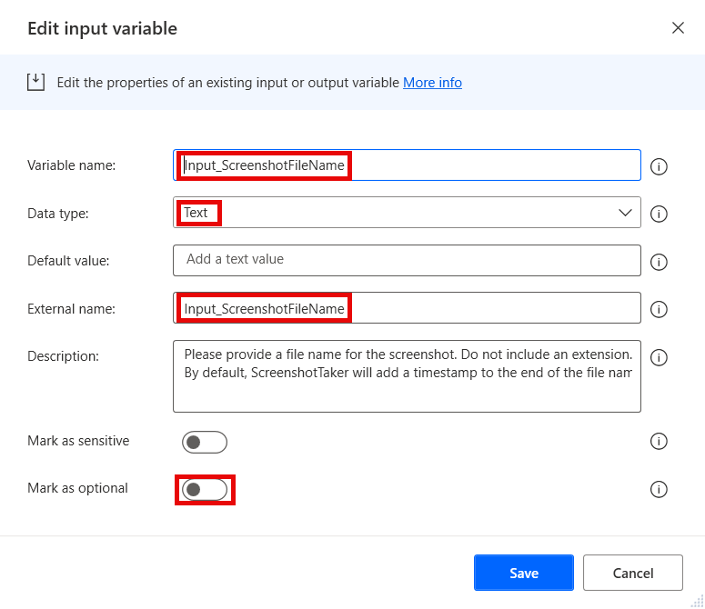

# ScreenshotMaker

The screenshot maker flow takes a screenshot of the machine and saves it as a file in a directory based on the inputs provided.
It is to be called as a child flow by other flows, and as such it should reside as a utility flow that does not need to be copied, but can be re-used.

It is to be used on errors in flows when user interface automation is involved to help debugging those errors. It is especially useful in unattended flows.
It can also be used as a form of logs for storing some runtime data in the form of screenshots, too.

## Version compatibility

The code is compatible with Power Automate Desktop version 2.42.317.24061. Compatibility with other versions is not guaranteed, but it might work with earlier versions, too.
The code currently does not have a version for flows with Power Fx enabled. However, as this is a flow that should be called as a child flow by other flows, it should not matter. It should simply be created without enabling Power Fx.

## Inputs expected

There are several inputs required by this flow, and a couple that are optional (depending on other parameters):

1. **Input_ScreenshotFileName** - Should contain the desired file name of the screenshot. Can include a work item number or id, or any other means of identification. It ss used to save the screenshot as a file. It should not include a file extension. By default, the file will be saved as a .png file and a timestamp will be added to the end of the file name.
1. **Input_ScreenshotsDirectory** - Should contain the directory to save the screenshot file to. If left blank, the screenshot will not be taken. If the directory is provided, but it does not exist on the machine, the screenshot will also not be taken.

## Output produced

The flow produces several output variables that are returned to the parent flow after execution:

1. **Output_Message** - Contains the response of the flow. Can either return a success, or a failure response. Should be used by the parent flow for any logging after taking a screenshot (or failing to do so). Should be marked as **sensitive** in case the message may contain any sensitive data.
1. **Output_ScreenshotFileName** - Contains the file name for the screenshot file if it is created.
1. **Output_Status** - Contains the status code for the response of the flow. Uses standard HTTP status codes. Can either return a success (200), or a failure status (4xx, 5xx). Should be checked by the parent flow to verify if taking a screenshot succeeded.

## Minimal path to awesome

1. If you have not prepared an environment and a solution for the framework yet:
    1. Open the browser and navigate to [Power Automate cloud portal](https://make.powerautomate.com/)
    1. Create an dedicated environment for the Framework (DEV environments for other flows should contain a managed solution of the Framework - see **Notes** below)
    1. Create a solution called **PADFramework** in the new environment
1. Open **Power Automate Desktop**
1. Create a new flow called **PADFramework: ScreenshotMaker** - make sure to not enable Power Fx when creating it

    

1. Create the following input and output variables (use the same names for "Variable name" and "External name" fields to avoid unneccessary confusion):
    1. Input:
        1. Input_ScreenshotFileName (Data type - Text; Mark as sensitive - False; Mark as optional - False)

            

        1. Input_ScreenshotsDirectory (Data type - Text; Mark as sensitive - False; Mark as optional - True)
    1. Output:
        1. Output_Message (Data type: Text; Mark as sensitive - True)

            

        1. Output_ScreenshotFileName (Data type: Text; Mark as sensitive - False)
        1. Output_Status (Data type: Number; Mark as sensitive - False)
1. Copy the code from **main.txt** in `\source\`
1. Paste it into the Power Automate Desktop flow designer window into the **Main** subflow to have the actions created automatically.
1. Review the code for any syntax errors

    

1. Click **Save** in the flow designer
1. Add the **PADFramework: ScreenshotMaker** flow to the **PADFramework** solution for exporting it to other environments

    

1. When exporting to other environments, export it as a **Managed** solution, so that it can be used, but not modified. Logger should be managed even in DEV environments for other flows (see **Notes** below)
1. **Enjoy**

## Notes

### Environments

The Framework should have its own dedicated development environment. This is the only environment where the Framework should reside as an unmanaged solution. 

It should be imported as a managed solution to all other environments where flows will use the framework, including normal DEV, TEST, UAT and other non-production environments. This is so that changes cannot be made to the framework outside of its own DEV environment, but it can be used by calling utility flows such as the **Logger** as child flows, as well as making copies of the template flows for new projects.

### Controlling whether or not a screenshot should be taken

It is recommended to have the screenshots directory stored externally by the parent flow in a configurations asset (file, database, etc.), so it can easily be turned on and off when needed, without modifying the flow.
When the directory is provided as a blank value or a path to a folder that does not exist on the system, the screenshot will not be taken. A 4XX status will then be returned by the screenshot maker flow, which can be handled by the parent appropriately without throwing an error if needed.

