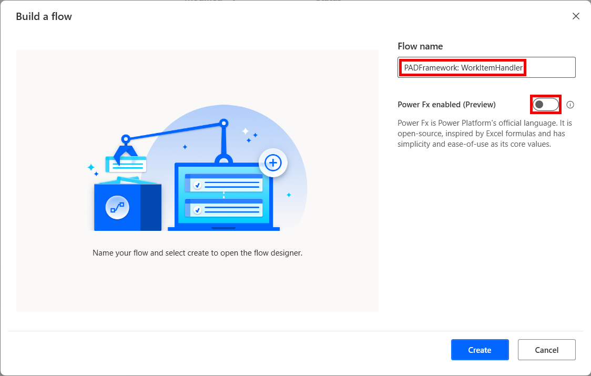
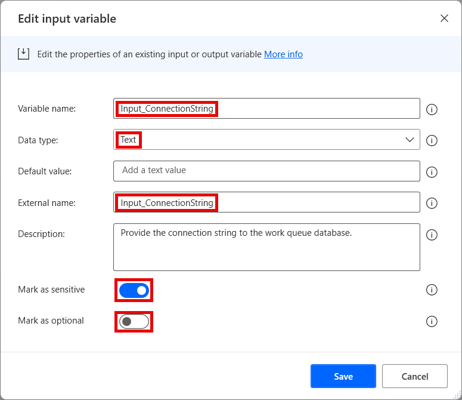
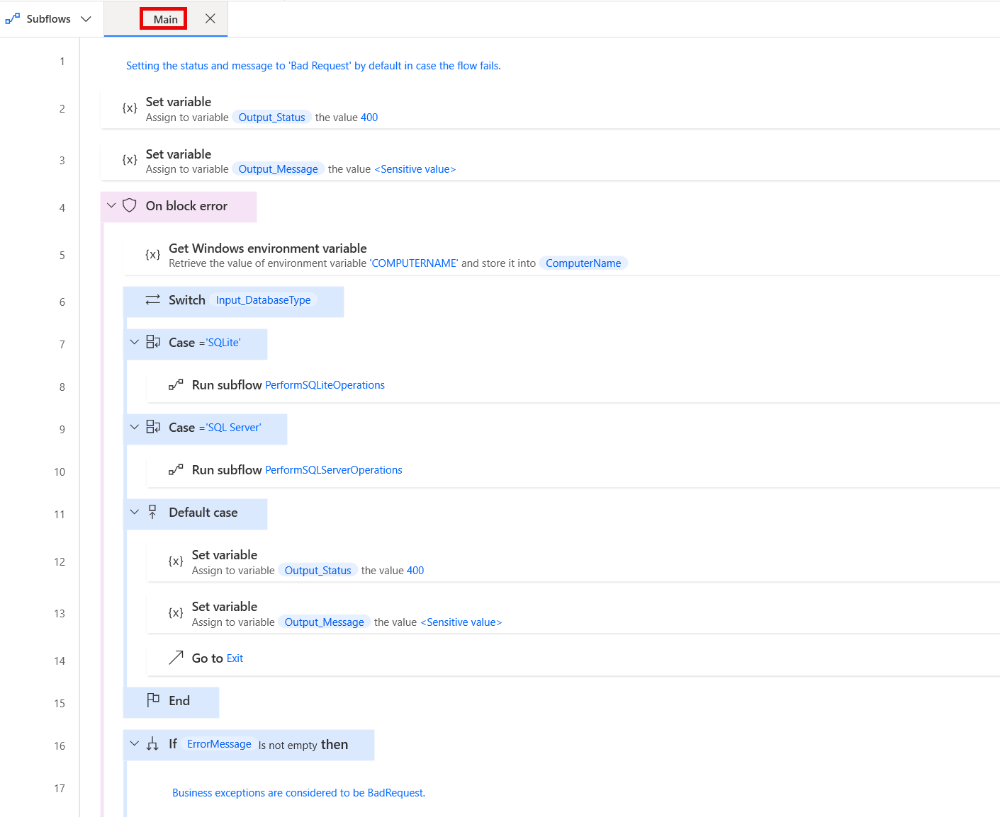
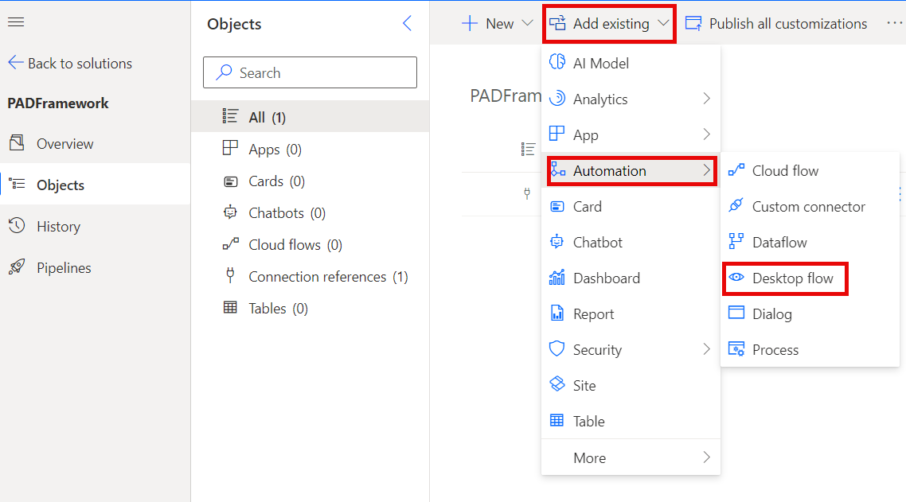

# WorkItemHandler

The Work Item Handler flow performs operations with work item data in a database (SQL Server or SQLite) based on the inputs provided.
It is to be called as a child flow by other flows, and as such it should reside as a utility flow that does not need to be copied, but can be re-used.

## Disclaimer
This utility flow is only required if you want to store work item data in a custom database - i.e. build your own custom queue management functionality. If you use the default Power Automate Work Queues, this utility flow is irrelevant and does not need to be created.

## Version compatibility

The code is compatible with Power Automate Desktop version 2.45.375.24159 and later. Backward compatibility is not guaranteed, but it might work with earlier versions, too.
The code currently does not have a version for flows with Power Fx enabled. However, as this is a flow that should be called as a child flow by other flows, it should not matter. It should simply be created without enabling Power Fx.

## Inputs expected

There are several inputs required by this flow, and a couple that are optional (depending on other parameters):

1. **Input_ConnectionString** - Should contain the connection string for the data operations. Should be marked as **sensitive** in case the string contains any sensitive information, such as credentials.
1. **Input_DatabaseType** - Should contain the database type, as the flow runtime depends on it. When SQLite is used, direct SQL statements are executed. For SQL Server, stored procedures are called instead. Currently supported options are:
    1. SQLite
    1. SQL Server
1. **Input_Environment** - Should contain the environment name. Only required when operation is *Get* and database type is *SQL Server*. Optional in all other cases. Currently supported options are:
    1. DEV
    1. TEST
    1. PROD
1. **Input_FlowName** - Should contain the name of the parent flow. This is used in several operations.
1. **Input_MaxRetrieveCount** - Should contain the maximum allowed retry count for a work item. Work items that are still open but have exceeded this count will be ignored. Should be marked as **optional** as it is only relevant for *Get* operations.
1. **Input_ProjectName** - Should contain the name of the project to identify the relevant entries in the database. Should be marked as **optional**, as it is only required for *Get* and *Upsert* operations (e.g. when getting a work item or updating/inserting one).
1. **Input_WorkItemData** - Should contain the work item data custom object. Should be marked as **sensitive** as the data may contain sensitive information. Should also be marked as **optional**, as it is only needed for *Upsert* operations.
1. **Input_WorkItemDataSource** - Should contain the data source for the data, such as a file path, an email address, etc. Should be marked as **sensitive** as it may contain sensitive information. Should also be marked as **optional**, as it is only needed for *Upsert* operations.
1. **Input_WorkItemId** - Should contain the work item Id to be updated/completed/reset. Should be marked as optional, as it is not required for *Get* type operations.
1. **Input_WorkItemMessage** - Should contain the message for the work item result. Should be marked as **sensitive** as it may contain sensitive information. Should also be marked as **optional**, as it is only required when inserting work item results, completing work items, etc., but irrelevant for *Get* type operations.
1. **Input_WorkItemNumber** - Should contain the number of the work item. Should be marked as **optional**, as it is only required when inserting/updating work items, etc., but irrelevant for *Get* type operations.
1. **Input_WorkItemOperation** - Should contain the operation to be performed on the work item. Currently supported options are:
    1. Complete - closes the work item.
    1. Get - retrieves the work item with it's status and data.
    1. Upsert - either inserts a work item if it doesn't exist or updates it, if it does exist (by using the combination of ProjectName and WorkItemNumber)
1. **Input_WorkItemProcessingStartTime** - Should contain the timestamp for when the work item processing started. Should be marked as **optional** as it is required when completing and updating work items, but not for *Get* type operations.
1. **Input_WorkItemReason** - Should contain the reason for the work item status when updating or completing it. Should be marked as **optional** as it is only required when completing unsuccessfully or updating due to a retry.
1. **Input_WorkItemStatus** - Should contain the status for the work item. Should be marked as **optional** as it is required when completing and updating work items, but not for *Get* type operations.

## Output produced

The flow produces several output variables that are returned to the parent flow after execution:

1. **Output_Message** - Contains the response of the flow. Can either return a success, or a failure response. Should be used by the parent flow for any logging after calling the child flow. Should be marked as **sensitive** in case the message may contain any sensitive data.
1. **Output_Status** - Contains the status code for the response of the flow. Uses standard HTTP status codes. Can either return a success (200), or a failure status (4xx, 5xx). Should be checked by the parent flow to verify if the child flow succeeded.
1. **Output_WorkItemData** - Returns the custom object with work item data. Is generally useful when using the *Get* operation. In other cases, it either returns an empty object, or the same object that was provided to it as inputs. Should be marked as **sensitive** as the data may contain sensitive values.
1. **Output_WorkItemDataSource** - Returns the data source for the work item. Is generally useful when using the *Get* operation. In other cases, it either returns an empty value, or the same value that was provided to it as inputs. Should be marked as **sensitive** as it may contain sensitive values.
1. **Output_WorkItemId** - Returns the Id of the work item. Is generally useful when using the *Get* operation. In other cases, it either returns an empty value, or the same value that was provided to it as inputs.
1. **Output_WorkItemNumber** - Returns the Number of the work item. Is generally useful when using the *Get* operation. In other cases, it either returns an empty value, or the same value that was provided to it as inputs.
1. **Output_WorkItemProcessingStartTime** - Returns the timestamp for when the work item was picked up for processing by a *Get* operation. In other cases returns an empty value.
1. **Output_WorkItemRetrieveCount** - Returns the number of times a specific work item has been retrieved. This is useful in cases when a decision needs to be made on whether the item should be closed or not after too many retries.

## Minimal path to awesome

1. If you have not prepared an environment and a solution for the framework yet:
    1. Open the browser and navigate to [Power Automate cloud portal](https://make.powerautomate.com/)
    1. Create an dedicated environment for the Framework (DEV environments for other flows should contain a managed solution of the Framework - see **Notes** below)
    1. Create a solution called **PADFramework** in the new environment
1. Open **Power Automate Desktop**
1. Create a new flow called **PADFramework: WorkItemHandler** - make sure to not enable Power Fx when creating it

    

1. Create the following input and output variables (use the same names for "Variable name" and "External name" fields to avoid unneccessary confusion):
    1. Input:
        1. Input_ConnectionString (Data type - Text; Mark as sensitive - True; Mark as optional - False)

            

        1. Input_DatabaseType (Data type - Text; Mark as sensitive - False; Mark as optional - False)
        1. Input_Environment (Data type - Text; Mark as sensitive - False; Mark as optional - True)
        1. Input_FlowName (Data type - Text; Mark as sensitive - False; Mark as optional - False)
        1. Input_MaxRetrieveCount (Data type - Number; Mark as sensitive - False; Mark as optional - True)
        1. Input_ProjectName (Data type - Text; Mark as sensitive - False; Mark as optional - True)
        1. Input_WorkItemObject (Data type - Custom object; Mark as sensitive - True; Mark as optional - True)
        1. Input_WorkItemDataSource (Data type - Text; Mark as sensitive - True; Mark as optional - True)
        1. Input_WorkItemId (Data type - Text; Mark as sensitive - False; Mark as optional - True)
        1. Input_WorkItemMessage (Data type - Text; Mark as sensitive - True; Mark as optional - True)
        1. Input_WorkItemNumber (Data type - Text; Mark as sensitive - False; Mark as optional - True)
        1. Input_WorkItemOperation (Data type - Text; Mark as sensitive - False; Mark as optional - False)
        1. Input_WorkItemProcessingStartTime (Data type - Text; Mark as sensitive - False; Mark as optional - True)
        1. Input_WorkItemReason (Data type - Text; Mark as sensitive - False; Mark as optional - True)
        1. Input_WorkItemStatus (Data type - Text; Mark as sensitive - False; Mark as optional - True)
    1. Output:
        1. Output_Message (Data type: Text; Mark as sensitive - True)

            

        1. Output_Status (Data type: Number; Mark as sensitive - False)
        1. Output_WorkItemData (Data type: Custom object; Mark as sensitive - True)
        1. Output_WorkItemDataSource (Data type: Text; Mark as sensitive - True)
        1. Output_WorkItemId (Data type: Text; Mark as sensitive - False)
        1. Output_WorkItemNumber (Data type: Text; Mark as sensitive - False)
        1. Output_WorkItemProcessingStartTime (Data type: Text; Mark as sensitive - False)
        1. Output_WorkItemRetrieveCount (Data type: Number; Mark as sensitive - False)
1. Create new subflows (see **Notes**): 
    1. **Init**
    1. **PerformSQLServerOperations** 
    1. **PerformSQLiteOperations** 
    1. **SQLServerCompleteWorkItem**
    1. **SQLServerGetWorkItem**
    1. **SQLServerUpsertWorkItem**
    1. **SQLiteCompleteWorkItem**
    1. **SQLiteGetFlowId**
    1. **SQLiteGetProjectId**
    1. **SQLiteGetStatuses**
    1. **SQLiteGetUnprocessedWorkItem**
    1. **SQLiteGetWorkItem**
    1. **SQLiteUpdateAccumulatedRunTime**
    1. **SQLiteUpdateWorkItemStatus**
    1. **SQLiteUpsertWorkItem**
1. Copy the code in the .txt files in `\source\` and paste it into Power Automate Desktop flow designer window into the appropriate subflows (see **Notes**):
    1. **main.txt** to the **Main** subflow
    1. **init.txt** to the **Init** subflow
    1. **perform-sql-server-operations.txt** to the **PerformSQLServerOperations** subflow
    1. **perform-sqlite-operations.txt** to the **PerformSQLiteOperations** subflow
    1. **sql-server-complete-work-item.txt** to the **SQLServerCompleteWorkItem** subflow
    1. **sql-server-get-work-item.txt** to the **SQLServerGetWorkItem** subflow
    1. **sql-server-upsert-work-item.txt** to the **SQLServerUpsertWorkItem** subflow
    1. **sqlite-complete-work-item.txt** to the **SQLiteCompleteWorkItem** subflow
    1. **sqlite-get-flow-id.txt** to the **SQLiteGetFlowId** subflow
    1. **sqlite-get-project-id.txt** to the **SQLiteGetProjectId** subflow
    1. **sqlite-get-statuses.txt** to the **SQLiteGetStatuses** subflow
    1. **sqlite-get-unprocessed-work-item.txt** to the **SQLiteGetUnprocessedWorkItem** subflow
    1. **sqlite-get-work-item.txt** to the **SQLiteGetWorkItem** subflow
    1. **sqlite-update-accumulated-run-time.txt** to the **SQLiteUpdateAccumulatedRunTime** subflow
    1. **sqlite-update-work-item-status.txt** to the **SQLiteUpdateWorkItemStatus** subflow
    1. **sqlite-upsert-work-item.txt** to the **SQLiteUpsertWorkItem** subflow
1. Review the code for any syntax errors

    

1. Click **Save** in the flow designer
1. Add the **PADFramework: WorkItemHandler** flow to the **PADFramework** solution for exporting it to other environments

    

1. When exporting to other environments, export it as a **Managed** solution, so that it can be used, but not modified. Logger should be managed even in DEV environments for other flows (see **Notes** below)
1. **Enjoy**

## Notes

### Environments

The Framework should have its own dedicated development environment. This is the only environment where the Framework should reside as an unmanaged solution. 

It should be imported as a managed solution to all other environments where flows will use the framework, including normal DEV, TEST, UAT and other non-production environments. This is so that changes cannot be made to the framework outside of its own DEV environment, but it can be used by calling utility flows such as the **WorkItemHandler** as child flows, as well as making copies of the template flows for new projects.

### SQLite and SQL Server subflows

In case you do not plan on supporting several databases (which is normal in actual business scenarios), you can skip creating the relevant subflows. It only makes sense to create those that are needed. For example, if you only plan on using SQL Server, there is no point in adding all of the SQLite subflows.